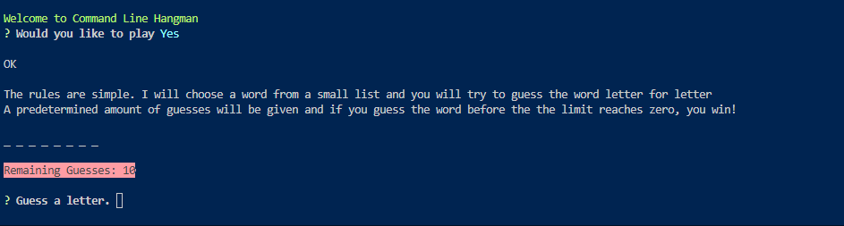

# Command Line Hangman

Command Line hangman is very similar to the original, only that it takes place in the command line!

All the rules are the same, the word pool is limited and the amount of guesses is chosen at random (a number between 10 and 15).

Play as many times as you want! All words are related to javascript in some way. 

